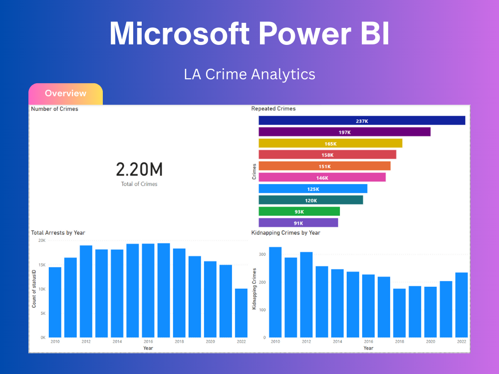

# Crime-Data-Analysis
This project aims to analyze crime data from the city of Los Angeles to gain a deeper understanding of the patterns and trends of criminal activity in the area. 
By using data visualization and statistical analysis techniques, we hope to identify hotspots of crime, potential predictors of crime activity, and potential strategies for crime prevention and reduction.

<h1>Key Accomplishments:</h1>
<ul>
  <li><strong> ETL Script: </strong>Given the weekly data updates, I developed a script to extract, transform, and load the data into the data warehouse.</li>
  <li><strong> Data Warehouse: </strong>I created a star schema data warehouse using a MySQL database to facilitate the weekly loading of updated data.</li>
  <li><strong> Dashboards: </strong> I utilized PowerBI to import and load data from my data warehouse, enabling the creation of insightful dashboards for extracting meaningful data insights.</li>
</ul>

<h1>Data Warehouse Schema: </h1>

<h1>Dashboards:</h1>

